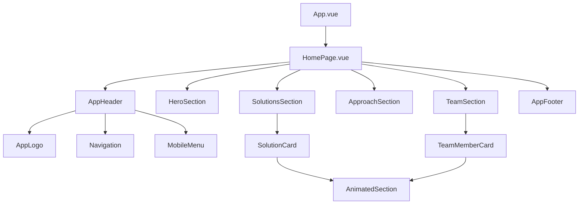

# Дизайн-документ: Fast Ecom Landing

## Обзор

Лендинг Fast Ecom — это одностраничное Vue 3 приложение, построенное по архитектуре Feature-Sliced Design (FSD). Сайт состоит из четырёх основных блоков: Hero (первый экран), Solutions (решения), Approach (подход) и Team (команда). Визуальный стиль — энергичный, светлый, современный с плавными анимациями.

### Ключевые технические решения

- **Vue 3 Composition API** с `<script setup>` для компактного и читаемого кода
- **TypeScript** для типобезопасности
- **FSD архитектура** для масштабируемости и поддерживаемости
- **CSS-анимации + Intersection Observer** для scroll-triggered эффектов
- **CSS Grid/Flexbox** для адаптивной вёрстки

## Архитектура

### FSD структура проекта

```
src/
├── app/                    # Инициализация приложения
│   ├── App.vue
│   ├── main.ts
│   └── styles/
│       ├── global.css
│       └── variables.css
├── pages/                  # Страницы
│   └── home/
│       └── ui/
│           └── HomePage.vue
├── widgets/                # Композитные блоки
│   ├── header/
│   │   └── ui/
│   │       └── AppHeader.vue
│   ├── hero-section/
│   │   └── ui/
│   │       └── HeroSection.vue
│   ├── solutions-section/
│   │   └── ui/
│   │       └── SolutionsSection.vue
│   ├── approach-section/
│   │   └── ui/
│   │       └── ApproachSection.vue
│   ├── team-section/
│   │   └── ui/
│   │       └── TeamSection.vue
│   └── footer/
│       └── ui/
│           └── AppFooter.vue
├── features/               # Фичи (интерактивность)
│   ├── smooth-scroll/
│   │   └── lib/
│   │       └── useSmoothScroll.ts
│   └── mobile-menu/
│       └── ui/
│           └── MobileMenu.vue
├── entities/               # Бизнес-сущности
│   ├── solution/
│   │   ├── model/
│   │   │   └── types.ts
│   │   └── ui/
│   │       └── SolutionCard.vue
│   └── team-member/
│       ├── model/
│       │   └── types.ts
│       └── ui/
│           └── TeamMemberCard.vue
└── shared/                 # Переиспользуемые модули
    ├── ui/
    │   ├── AppButton.vue
    │   ├── AppLogo.vue
    │   └── AnimatedSection.vue
    ├── lib/
    │   ├── useIntersectionObserver.ts
    │   └── useReducedMotion.ts
    └── config/
        └── constants.ts
```

### Диаграмма компонентов



## Компоненты и интерфейсы

### Shared компоненты

#### AnimatedSection.vue
Обёртка для секций с scroll-triggered анимациями.

```typescript
interface AnimatedSectionProps {
  animation?: 'fade-up' | 'fade-in' | 'slide-left' | 'slide-right'
  delay?: number
  threshold?: number
}
```

#### AppButton.vue
Универсальная кнопка с вариантами стилей.

```typescript
interface AppButtonProps {
  variant?: 'primary' | 'secondary' | 'outline'
  size?: 'sm' | 'md' | 'lg'
  href?: string
}
```

### Entity компоненты

#### SolutionCard.vue
Карточка решения с hover-эффектами.

```typescript
interface SolutionCardProps {
  solution: Solution
  colorScheme?: 'blue' | 'purple' | 'green' | 'orange'
}
```

#### TeamMemberCard.vue
Интерактивная карточка члена команды с 3D-эффектами.

```typescript
interface TeamMemberCardProps {
  member: TeamMember
}
```

### Widget компоненты

#### HeroSection.vue
Первый экран с анимированным появлением элементов.

#### SolutionsSection.vue
Сетка карточек решений с staggered анимацией.

#### ApproachSection.vue
Блок с технологическим стеком и описанием подхода.

#### TeamSection.vue
Сетка интерактивных карточек команды.

## Модели данных

### Solution (Решение)

```typescript
interface Solution {
  id: string
  title: string
  description: string
  icon: string
  colorScheme: 'blue' | 'purple' | 'green' | 'orange'
  features?: string[]
}
```

### TeamMember (Член команды)

```typescript
interface TeamMember {
  id: string
  name: string
  role: string
  description: string
  photo: string
  socialLinks?: {
    telegram?: string
    linkedin?: string
    github?: string
  }
}
```

### NavigationItem (Пункт навигации)

```typescript
interface NavigationItem {
  id: string
  label: string
  href: string
}
```

## Свойства корректности

*Свойство корректности — это характеристика или поведение, которое должно выполняться во всех допустимых сценариях работы системы. Свойства служат мостом между человекочитаемыми спецификациями и машинно-проверяемыми гарантиями корректности.*


На основе анализа критериев приёмки выделены следующие тестируемые свойства:

### Свойство 1: Уникальность цветовых схем карточек решений

*Для любой* пары карточек решений в Solutions_Section, если они относятся к разным категориям, то они должны иметь разные цветовые схемы.

**Валидирует: Требование 3.6**

### Свойство 2: Полнота данных карточки члена команды

*Для любой* карточки TeamMemberCard, отрендеренный HTML должен содержать: фото (img элемент), имя, роль и описание члена команды.

**Валидирует: Требование 5.3**

### Свойство 3: Полнота навигации

*Для любой* секции страницы (Hero, Solutions, Approach, Team), должна существовать соответствующая ссылка в навигации, ведущая к этой секции.

**Валидирует: Требование 6.1**

### Свойство 4: Отсутствие горизонтального скролла

*Для любого* viewport размера из диапазона [320px, 1920px], страница не должна иметь горизонтального скролла (document.body.scrollWidth <= window.innerWidth).

**Валидирует: Требования 8.1, 8.2, 8.3, 8.4, 8.5**

## Обработка ошибок

### Загрузка изображений
- При ошибке загрузки фото члена команды — показывать placeholder аватар
- При ошибке загрузки логотипа — показывать текстовый fallback "Fast Ecom"

### Анимации
- При включённом `prefers-reduced-motion` — отключать все анимации
- При отсутствии поддержки Intersection Observer — показывать контент без анимаций

### Навигация
- При клике на несуществующий якорь — игнорировать действие
- При отсутствии JavaScript — навигация должна работать через стандартные якорные ссылки

## Стратегия тестирования

### Unit-тесты

Используем **Vitest** для unit-тестирования:

- Тесты composables (`useIntersectionObserver`, `useSmoothScroll`, `useReducedMotion`)
- Тесты утилитных функций
- Тесты типов TypeScript

### Компонентные тесты

Используем **Vue Test Utils** + **Vitest**:

- Тесты рендеринга компонентов с разными props
- Тесты событий (клики, hover)
- Тесты слотов и условного рендеринга

### Property-Based тесты

Используем **fast-check** для property-based тестирования:

- Минимум 100 итераций на каждый property-тест
- Каждый тест аннотирован ссылкой на свойство из дизайн-документа
- Формат тега: **Feature: fast-ecom-landing, Property {номер}: {текст свойства}**

### E2E тесты (опционально)

Используем **Playwright** для end-to-end тестирования:

- Тесты навигации и smooth scroll
- Тесты адаптивности на разных viewport
- Визуальные регрессионные тесты

## Визуальный дизайн

### Цветовая палитра

```css
:root {
  /* Основные цвета */
  --color-primary: #3B82F6;      /* Синий */
  --color-secondary: #8B5CF6;    /* Фиолетовый */
  --color-accent: #10B981;       /* Зелёный */
  
  /* Фоновые цвета */
  --color-bg-light: #F8FAFC;
  --color-bg-white: #FFFFFF;
  
  /* Текстовые цвета */
  --color-text-primary: #1E293B;
  --color-text-secondary: #64748B;
  
  /* Цветовые схемы карточек */
  --scheme-blue: linear-gradient(135deg, #3B82F6, #1D4ED8);
  --scheme-purple: linear-gradient(135deg, #8B5CF6, #6D28D9);
  --scheme-green: linear-gradient(135deg, #10B981, #059669);
  --scheme-orange: linear-gradient(135deg, #F59E0B, #D97706);
}
```

### Типографика

```css
:root {
  --font-family: 'Inter', -apple-system, BlinkMacSystemFont, sans-serif;
  --font-size-xs: 0.75rem;
  --font-size-sm: 0.875rem;
  --font-size-base: 1rem;
  --font-size-lg: 1.125rem;
  --font-size-xl: 1.25rem;
  --font-size-2xl: 1.5rem;
  --font-size-3xl: 1.875rem;
  --font-size-4xl: 2.25rem;
  --font-size-5xl: 3rem;
}
```

### Анимации

```css
:root {
  --transition-fast: 150ms ease;
  --transition-base: 300ms ease;
  --transition-slow: 500ms ease;
  
  --animation-fade-up: fade-up 0.6s ease forwards;
  --animation-fade-in: fade-in 0.4s ease forwards;
}

@keyframes fade-up {
  from {
    opacity: 0;
    transform: translateY(20px);
  }
  to {
    opacity: 1;
    transform: translateY(0);
  }
}

@keyframes fade-in {
  from { opacity: 0; }
  to { opacity: 1; }
}
```

### Breakpoints

```css
/* Mobile first approach */
--breakpoint-sm: 640px;
--breakpoint-md: 768px;
--breakpoint-lg: 1024px;
--breakpoint-xl: 1280px;
--breakpoint-2xl: 1536px;
```
